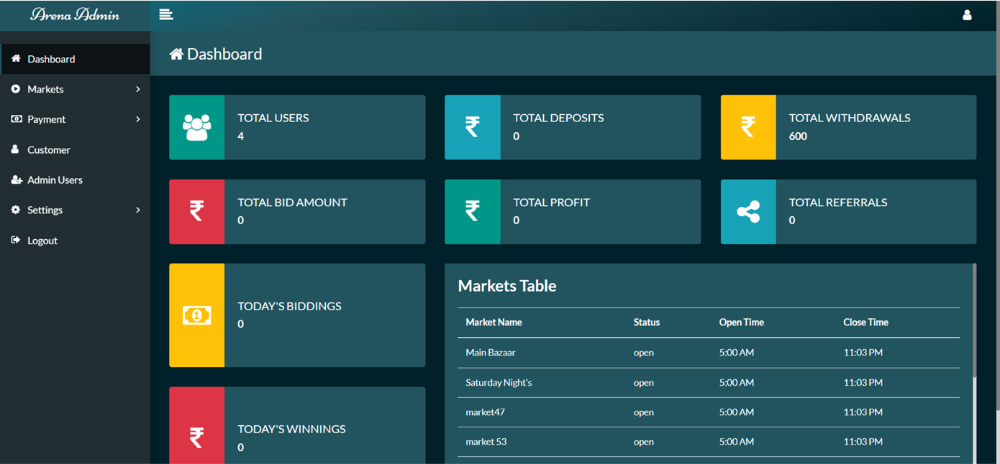

# Betting App

### Project description :

The Mobile and Web-based Number Betting Application is a cloud-powered platform that runs on any type of device, allowing users to place bets on single, double, and triple digit numbers. The primary objective of the application is to provide users with multiple markets that run on a daily and weekly basis, providing them with ample opportunities to earn rewards based on the bets placed.

The application is built using HTML, CSS, Bootstrap, JavaScript, and PHP, with the MySQL database supporting this architecture. This ensures that the platform is professional and technically sound, providing users with a seamless experience.

The application also has Firebase setup to send notifications to users, ensuring that they are always up-to-date with the latest events and markets available. Additionally, a payment gateway is integrated into the platform to add money to the user's wallet and distribute rewards to the users. This enables users to easily manage their finances on the platform, ensuring that the process of placing bets and receiving rewards is simple and streamlined.

In conclusion, the Mobile and Web-based Number Betting Application is an innovative and exciting platform that offers users the opportunity to place bets on a variety of markets and earn rewards based on the bets placed. With a seamless user experience, professional design, and technical soundness, the platform is sure to attract users looking for an exciting and convenient way to bet on their favorite numbers.

## Screenshots

### [Checkout All Screenshots](screenshots)

#
`#Reactjs` `#Redux` `#Material UI` `#API Integration` `#axios` `SignUp` `SignIn` `#Reset Password` `#Forgot Password` `#Admin Panels` `#PWA`
